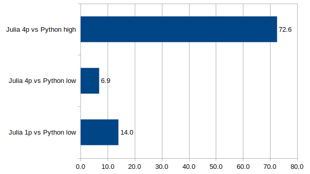

# Why am I using Julia?

## Introduction

I started programming in 1976 using the KIM 1 and the 6502 machine language.
Since then I learned and used many languages, Assembler, Pascal, Delphi, Basic,
Foxpro, Java, C, C++, Bash, Matlab, Python and more...

|  |
| :--: |
| *KIM 1* |

Why do I think that Julia is superior to all of them in many (not all)
applications?

## What is so great about Julia?

### Reason no one: speed
When you need to process large amounts of data speed is important. Julia is a just-in-time compiled language using the mature LLVM compiler infrastructure, so you get fast machine code for different processors. In contrast to Python also multi threading is well supported. I wrote a simulation package in Python+Numba, and re-wrote it in Julia. 

|  |
| :--: |
| Performance advantage of Julia vs Python+Numba |

Depending on the test case Julia was 7 to 70 times faster than Python+Numba. And writing the Julia code was much easier because mixing Python with Numba is a real pain because they look similar, but behave very differently.

If you only use Python with algorithms for which C++ or Fortran libraries are available, then you will not see much of an advantage from using Julia. But if you write new programs or libraries using new algorithms Julia is much faster.

### Reason no two: simplicity and elegance
You can operate with vectors as you would do it in mathematical notation, you can use `×` for the cross product and `⋅` for the dot product. And functions can return tuples (multiple values), which is very useful.
```julia
function kite_ref_frame(s::KPS3)
    c = s.pos[end-1] - s.pos[end]
    z = normalize(c)
    y = normalize(s.v_apparent × c)
    x = normalize(y × c)
    x, y, z
end
```
And you can use greek letters in the code:
```julia
using Distributions, Random

T = [84.5, 83.6, 83.6] # temperature measurements
μ = mean(T)            # average cpu temperature
σ = 2.5                # 95.45 % of the measurements are within ± 5 deg
d = Normal(μ, σ)
good = cdf(d, 88.0)    # this percentage of the cpus will not start to throttle
```
And you can write arrays cleanly:
```julia
julia> A = [1 2π
            3 4π]
2×2 Matrix{Float64}:
 1.0   6.28319
 3.0  12.5664
```


### Reason no three: Built-in package manager
In Python it can be very difficult to install packages. There is `pip` that might work, but not good for binary dependancies. There is `easy_install`, there is `conda`... Many package managers, but all of them only work sometimes, for some packages on some operating systems... On Julia is only one package manager and it works fine with all packages on all supported operating systems (Windows, Mac, Linux...) on ARM and X86.

You can reach the prompt of the package manager by typing `]`. It looks like this:
```julia
(@v1.8) pkg> st
Status `~/.julia/environments/v1.8/Project.toml`
  [e1d33f9a] DLMReader v0.4.5
  [31c24e10] Distributions v0.25.66
  [5c01b14b] InMemoryDatasets v0.7.7
⌃ [14b8a8f1] PkgTemplates v0.7.26
⌃ [91a5bcdd] Plots v1.29.0
  [0c614874] TerminalPager v0.3.1
Info Packages marked with ⌃ have new versions available
```
The prompt tells you which environment is active, and you can add, update and delete packages, but also display statistics or download the source code of a package for development. Each Julia package as a clear definition of the versions of the dependencies it works with in a file called Project.toml. Therefore it is easy to write code that will never brake in the future. 

### Reason no four: an awsome community

### State-of-the-art solvers for differencial equations

### State-of-the-art optimizers

## Limitations

### Limitations of language/ compiler

#### Compilation and load times

#### For use on embedded systems
Currently, with Julia 1.8 the first issue is the amount of RAM that is needed: Using Julia
with less than 4GB RAM is not very enjoyable. A cross compiler is missing. For these 
reasons writing code for smaller embedded systems is not feasable. The smallest system
I would use with Julia is a Raspberry Pi 4 and a 64 bit OS.

I know that the Julia developers work hard to mitigate these issues, so in a few years
Julia will hopefully also be usable on smaller embedded systems.

### Limitations of the ecosystem
The first limitation I see is that there is no easy to use, well integrated GUI library. Yes, you can use [QML.jl](https://github.com/barche/QML.jl) or [GTK.jl](https://github.com/JuliaGraphics/Gtk.jl) and many others, but they all have their issues, one of the issues is the lack of Julia specific documentation.

My prefered solver for 


