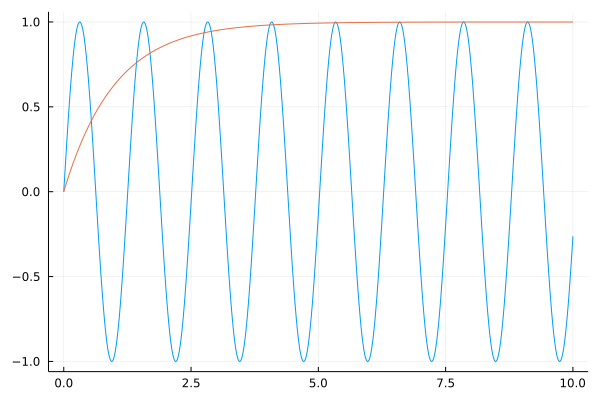

# Working with projects
## Introduction
When you start to use Julia you might ask yourself: How shall I structure my code?
There are different approaches for each programming language.

## Simple scripts
If you just write short, simple scripts that are not using any packages you can just keep them in one file. If you care about performance you should put everything in a
function. Example:
```julia
# constants
const LANG="DE"

# functions
function hello(name)
    if LANG == "DE"
        println("Hallo liebe/r $name !")
    else
        println("Hello dear $name !")
    end
end

# main program
function main()
    hello("Peter")
    hello("Jane")
end

main()
nothing
```
The structure is:
- constants
- functions
- main function
- call the main function
- return nothing

Do not use global variables! That kills your performance.

If you store this code in a file with the name `hello.jl` you can execute it from the REPL with the command:
```julia
include("hello.jl")
```

The advantage of having a main() function is that you can include some error checks and return an error code if they fail. Furthermore you can measure the performance by running:
```julia
@time("hello.jl")
@time main()
```
The first timing you get includes the compilation time, the second number shows the pure execution time.

It is a good habit to return `nothing`, unless you want to return your result, e.g. a plot (diagram) or a dataset.

## Scripts that are using packages
If you are using any packages, you should create a proper project to keep track of your dependencies and their versions.

That is simple:
Creating a project does not mean to create a package. It is much simpler:
```bash
mkdir my_project
cd my_project
mkdir src
julia --project="."
```
Now add the packages you need:
```julia
using Pkg
pkg"add Plots"
pkg"add DataFrames"
```
Now put your code in a file in the src folder, for example like this:
```bash
cd src
gedit my_plot.jl
```
and put the following code into it:
```julia
using Plots, DataFrames

function main()
    time = 0:0.01:10             # step range from 0 to 10 step 0.1
    u    = sin.(time*5)          # signal with a frequency of 5 rad/s
    step = 1 .- 1 ./ exp.(time)  # step response
    df  = DataFrame(;time, u, step)
    plt = plot(df.time,  u, legend=false)
    plot!(df.time, step)
    plt
end
plt = main()
```
and save it.
If you want to run it, make sure you are in the `my_project` folder and then
start julia with:
```bash
julia --project
```
and execute your script with:
```julia
include("src/my_plot.jl")
```
You should see the following plot:



When you are happy with your code and the packages you are using, make a backup copy
of your Manifest.toml file:
```bash
cp Manifest.toml Manifest.toml.bak
```
If you - half a year later - update your packages and your code stops to work, just restore the Manifest file:
```bash
cp Manifest.toml.bak Manifest.toml
```
No need to create any module or Julia package...

## Using compat to improve long term robustness
If you add compat bounds to the versions of the packages you are using your project becomes more robust. This means,
if you are adding new packages in the future the currently used packages will not be unintentionally upgraded.

If you are using Julia 1.8 or newer you can use the following approach:

1. launch julia with `julia --project`
2. enter the package manager mode by pressing the key `]`
3. list the status of your project:
```julia
(my_project) pkg> st
Status `~/repos/my_project/Project.toml`
  [a93c6f00] DataFrames v1.3.4
  [91a5bcdd] Plots v1.31.7
```
If you are careful allow only bugfixes for the installed packages which means only the last digit of the version number is allowed to be increased. To achieve that, type
```julia
(my_project) pkg> compat
      Compat `~/repos/my_project/Project.toml`
  Select an entry to edit:
 >            julia      none
   [a93c6f00] DataFrames none
   [91a5bcdd] Plots      none
```
Now select julia and enter 1.8, DataFrames and enter 1.3 and Plots and enter 1.31. Use the first two digits of the version numbers of the currently installed packages as shown by the command `st`.
If you now type `compat` again it should look like this:
```julia
(my_project) pkg> compat
      Compat `~/repos/my_project/Project.toml`
  Select an entry to edit:
 >            julia      1.8
   [a93c6f00] DataFrames 1.3
   [91a5bcdd] Plots      1.31
```
Press `q` to quit and then `backspace` to quit the package manager mode.

*Congratulations!*

 You have now set limits for your package versions, and if you should type `up` in the package manger the next time you will only get bugfixes for the installed packages, but nothing that could brake your current code.

 Your Project.toml file should now look like this:
 ```julia
 ufechner@desktop:~/repos/my_project$ cat Project.toml
[deps]
DataFrames = "a93c6f00-e57d-5684-b7b6-d8193f3e46c0"
Plots = "91a5bcdd-55d7-5caf-9e0b-520d859cae80"

[compat]
DataFrames = "1.3"
Plots = "1.31"
julia = "1.8"
 ```
 If you have a Julia version older than 1.8 you can also just edit the file Project.toml manually with your preferred editor to add the compat section. If you code was my_projected with multiple package or Julia versions, you can create a list, for example:
 ```julia
 [compat]
 julia = "1.6,1.7,1.8"
 ```

## Further reading
If you want to understand the meaning of the `semantic versioning` that is used by Julia packages, please read the section [Compatibility](https://pkgdocs.julialang.org/v1/compatibility/) in the documentation of the package manager.

## Outlook
If you want to create re-usable packages that you want to use in multiple programs/ projects consider to create real Julia packages. This is a little bit more complicated, but it has the advantage of automated my_projects and easy installation for yourself and others. I will talk about that in one of my future blog posts.